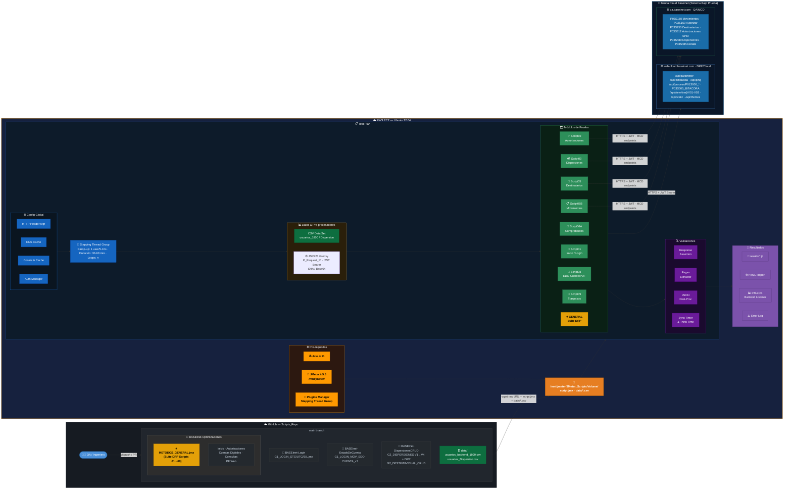

# 🏦 Scripts_Repo — JMeter Performance Tests · Banca Cloud Baseinet

Repositorio centralizado de scripts de pruebas de rendimiento para la plataforma **Banca Cloud (Baseinet)**, implementados con **Apache JMeter**. Los scripts simulan flujos reales de usuarios bancarios para evaluar la estabilidad, capacidad y tiempos de respuesta de los servicios en ambientes **Cloud (DRP)** y **QA (MCD)**.

> 📄 **Matriz de Casos de Prueba — Optimizaciones**: [`MATRIZ_PRUEBAS_OPTIMIZACIONES.md`](tests/scripts/Baseinet/BASEInet-Optimizaciones/MATRIZ_PRUEBAS_OPTIMIZACIONES.md)

---

## 🗺️ Diagrama de Arquitectura — AWS EC2 Ubuntu

Flujo completo desde GitHub hasta el Sistema Bajo Prueba, pasando por el generador de carga en AWS.



---

## 📁 Estructura del Repositorio

```
Scripts_Repo/
├── README.md
├── .gitignore
├── .github/
│   └── pull_request_template.md       # Template para PRs de scripts
├── data/                              # Archivos CSV de usuarios y configuración
│   ├── usuarios_backend_baseinet_1800.csv         # Sesiones (~1800 usuarios)
│   ├── usuarios_backend_baseinet_Dispersion.csv   # Lotes de dispersión
│   ├── usuarios_backend_baseinet_agosto25.csv
│   └── sample*.txt                                # Muestras de prueba
└── tests/
    └── scripts/
        └── Baseinet/
            ├── BASEInet-Login/
            ├── BASEInet-EstadoDeCuenta/
            ├── BASEInet-DispersionesCRUD/
            └── BASEInet-Optimizaciones/
                ├── G2_PAQUETE_1_BASEINET_DRP_METODOS_GENERAL.jmx  ⭐ Suite DRP
                ├── Inicio/
                ├── Cuentas Digitales/
                ├── Modulo Autorizaciones/
                ├── Modulo Consultas/
                └── PF Web/
```

---

## 🗂️ Módulos de Scripts

### 🔑 BASEInet-Login — Autenticación
Scripts de prueba de carga para el proceso de login en distintos ambientes.

| Script | Ambiente | Descripción |
|---|---|---|
| `G1_BASEINET_CLOUD_LOGIN_STG_v7.jmx` | STG | Login Staging |
| `G1_BASEINET_CLOUD_LOGIN_UTG_v7.jmx` | UTG | Login User Testing |
| `G1_SIL_LOGIN_v1.jmx` | SIL | Módulo SIL |

---

### 📄 BASEInet-EstadoDeCuenta — Consultas

| Script | Descripción |
|---|---|
| `G1_BASEINET_CLOUD_LOGIN_MOV_EDO-CUENTA_v7.jmx` | Login + consulta de movimientos + descarga PDF |

---

### 💳 BASEInet-DispersionesCRUD — Dispersiones y Destinatarios
Flujos de operación de negocio y administración de cuentas destino.

| Script | Descripción |
|---|---|
| `G2_BASEINET_QA_CLOUD_DISPERSIONES_V1/V2/V3.jmx` | Dispersiones (versiones evolutivas) |
| `G2_BASEINET_QA_CLOUD_DISPERSIONES_TC_V4.jmx` | Versión con Thread Group configurado |
| `G2_BASEINET_DRP_CLOUD_DISPERSIONES_TC_V1.jmx` | Dispersiones en DRP Cloud |
| `G2_BASEINET_BASEINET_SCRIPT04_QA_CLOUD_DESTINDIVIDUAL_CRUD.jmx` | CRUD de destinatarios individuales |

---

### ⚡ BASEInet-Optimizaciones — Módulo MCD (11 Scripts)

Scripts optimizados para alta concurrencia en microservicios específicos.

> 📄 **Ver [Matriz completa de casos de prueba](tests/scripts/Baseinet/BASEInet-Optimizaciones/MATRIZ_PRUEBAS_OPTIMIZACIONES.md)**

| Submódulo | Script(s) | Servicios Impactados | Datos |
|---|---|---|---|
| ⭐ **General DRP** | `METODOS_GENERAL.jmx` | Suite Scripts 01→09 | `_1800.csv` + `_Dispersion.csv` |
| **Inicio** | Script01 | `ScValidateCuenta`, `CdGetCustomerNotices`, `ScDoIniciarSesion`, `ScDoFinalizarSesion` | `_1800.csv` |
| **Autorizaciones** | Script02 | `CdDoAutorizarTraspaso`, `CdGetTraspasos` (SPEI) | `_1800.csv` |
| **Dispersiones** | Script03 / Script15 | `CdLoadArchivoLoteBase64` | `_Dispersion.csv` |
| **Destinatarios** | Script05 | `CdGetDestinatariosAutorizadosPageInDB` | `_1800.csv` |
| **Comprobantes** | Script06A | `CdGetTraspasosComprobantes` (SPEI, SIPARE, PECE, Recargas) | `_1800.csv` |
| **Movimientos** | Script06B | `CdGetMovimientos` (consulta + paginación) | `_1800.csv` |
| **EDO-Cuenta** | Script08 | `CdGetEstadoCuentaPdf`, `CdGetEstadoCuentaMt940`, `CdGetMovimientos` | `_1800.csv` |
| **Traspasos** | Script09 | `CdGetCuentasTraspasos` (BancoBASE) | `_1800.csv` |
| **PF Web** | Script06 PF | `CdGetCuentas` | `_1800.csv` |

---

## 🔧 Componentes Técnicos del Test Plan

Cada script `.jmx` comparte esta arquitectura interna:

| Componente | Función |
|---|---|
| **HTTP Header Manager** | Headers globales (Content-Type, Authorization) |
| **DNS Cache Manager** | Resolución DNS optimizada bajo carga |
| **Cookie / Cache Manager** | Manejo de sesión y respuestas cacheadas |
| **Stepping Thread Group** | Ramp-up progresivo: 1 usuario cada 5–10 s |
| **CSV Data Set** | Alimenta usuarios, cuentas y credenciales por hilo |
| **JSR223 PreProcessor (Groovy)** | Genera `P_Request_ID`, firma JWT, encode Base64 |
| **Regex / JSON Extractor** | Correlación de `C_JWT_KEY`, `C_THEME`, tokens de sesión |
| **Response Assertion** | Valida HTTP 200 y estructura de respuesta |
| **Synchronizing Timer** | Simula ráfagas sincronizadas de usuarios |
| **Think Time / Random Timer** | Comportamiento realista entre transacciones |
| **Throughput Controller** | Control de dispersiones (+900 lotes) |
| **Backend Listener → InfluxDB** | Métricas en tiempo real |
| **ResultCollector (errors)** | Log de errores independiente |

---

## ⚙️ Pre-requisitos

| Requisito | Versión mínima |
|---|---|
| **Apache JMeter** | `>= 5.5` |
| **Java (JDK)** | `>= 11` (OpenJDK recomendado) |
| **JMeter Plugins Manager** | Última versión (incluye Stepping Thread Group) |

---

## 🚀 Ejecución Local

Para asegurar que los scripts encuentren los archivos CSV, **ejecuta siempre desde la raíz del repositorio**.

```bash
# Modo No-GUI (recomendado para carga)
jmeter -n \
  -t tests/scripts/Baseinet/BASEInet-Login/G1_BASEINET_CLOUD_LOGIN_STG_v7.jmx \
  -l results/resultado.jtl \
  -e -o results/report/
```

---

## ☁️ Ejecución en Generador de Carga AWS (Ubuntu)

### Paso a paso

```bash
# 1. Ingresar como superusuario
sudo su

# 2. Ir al directorio de trabajo
cd /mnt/jmeter/JMeter_Scripts/Volume

# 3. Descargar el script desde GitHub
wget -O G2_PAQUETE_1_BASEINET_DRP_METODOS_GENERAL.jmx \
  https://raw.githubusercontent.com/israelrizo/Scripts_Repo/refs/heads/main/tests/scripts/Baseinet/BASEInet-Optimizaciones/G2_PAQUETE_1_BASEINET_DRP_METODOS_GENERAL.jmx

# 4. Descargar los datos CSV
wget -O usuarios_backend_baseinet_1800.csv \
  https://raw.githubusercontent.com/israelrizo/Scripts_Repo/refs/heads/main/data/usuarios_backend_baseinet_1800.csv

wget -O usuarios_backend_baseinet_Dispersion.csv \
  https://raw.githubusercontent.com/israelrizo/Scripts_Repo/refs/heads/main/data/usuarios_backend_baseinet_Dispersion.csv

# 5. Ejecutar la prueba
jmeter -n \
  -t G2_PAQUETE_1_BASEINET_DRP_METODOS_GENERAL.jmx \
  -l results/result_$(date +%d%m%y).jtl \
  -e -o results/Result_$(date +%d%m%y)
```

> 💡 **Tip**: Sustituye el script por cualquier `.jmx` del repositorio usando la misma estructura de URL raw de GitHub.

### Configuración sugerida de carga

| Parámetro | Valor recomendado |
|---|---|
| **Thread Group** | Stepping Thread Group |
| **Ramp-up** | 1 usuario cada 5–10 segundos |
| **Duración** | 30 a 60 minutos de carga constante |
| **Loops** | Infinito (∞) hasta timeout |

---

## 📊 Datos y Resultados

| Recurso | Descripción |
|---|---|
| `data/usuarios_backend_baseinet_1800.csv` | Credenciales y cuentas (~1800 usuarios) para flujos de sesión |
| `data/usuarios_backend_baseinet_Dispersion.csv` | Datos para flujos de dispersión de pagos |
| `results/*.jtl` | Resultados crudos en formato JMeter |
| `results/Report_DDMMYY/` | Dashboard HTML auto-generado |
| **InfluxDB Backend Listener** | Métricas en tiempo real (configurable por URL) |

> ⚠️ **IMPORTANTE**: No incluyas credenciales reales en los commits a Git. Usa siempre el `.gitignore` para excluir archivos sensibles.

---

## 🌐 Endpoints del Sistema Bajo Prueba

### `web-cloud.baseinet.com` — DRP / Cloud

| Endpoint | Descripción |
|---|---|
| `/api/parameter` | Parámetros iniciales de sesión |
| `/api/initialData` | Datos de inicio de aplicación |
| `/api/ping` | Health check |
| `/api/process/P01S000_OBTENER_DATOS` | Obtención de datos de usuario |
| `/api/process/P01S000_VALIDA_VENCIMIENTO_TOKEN` | Validación de vigencia de JWT |
| `/api/process/P01S005_TOKEN_VENCIDO` | Renovación de token vencido |
| `/api/process/P03S005_GUARDAR_BITACORA` | Registro de bitácora |
| `/api/process/P03S150_CONS_MOVIMIENTOS` | Consulta de movimientos |
| `/api/process/P_VALIDA_GEOLOCATION_INDEX` | Validación de geolocalización |
| `/api/view/{version}/V01-V03` | Vistas de módulos |
| `/api/static/dictionary/{ver}/es` | Diccionario de textos |
| `/api/themes/custom/{ver}/{theme}` | Tema visual personalizado |
| `/api/storage/current-storage` | Configuración de almacenamiento |

### `qa.baseinet.com` — QA / Cloud MCD

| Endpoint | Descripción |
|---|---|
| `/api/process/P03S150` | Consulta de movimientos MCD |
| `/api/process/P03S160` | Autorización |
| `/api/process/P03S250` | Destinatarios (NEXT/PREV paginación, ELIMINAR) |
| `/api/process/P03S312` | Autorizaciones SPEI |
| `/api/process/P03S312_AUTORIZAR` | Autorizar traspaso |
| `/api/process/P03S312_CONSULTAR` | Consultar traspaso |
| `/api/process/P03S312_VALIDAR_CONFIRMAR` | Confirmar traspaso |
| `/api/process/P03S480` | Dispersiones |
| `/api/process/P03S480_CARGAR` | Cargar lote de dispersión |
| `/api/process/P03S480_CONF` | Confirmar dispersión |
| `/api/process/P03S485` | Detalle de dispersión |
| `/api/view/{ver}/V03/contents1/S*` | Vistas de submódulos MCD |

---

## 📝 Contribución

Al agregar o modificar un script:

1. Crea una rama descriptiva: `feature/nuevo-script` o `fix/nombre-modulo`
2. Sigue la convención de nombres:
   ```
   G<Grupo>_PAQUETE_<N>_<Sistema>_<Ambiente>_<Metodos>_<Descripcion>.jmx
   ```
3. Abre un Pull Request usando el template predefinido (`.github/pull_request_template.md`)
4. Actualiza la **Matriz de Pruebas** si agregas un nuevo caso

---

## 👥 Autores

- **Israel Lopez** — [@israel-lopez-realtor](https://github.com/israel-lopez-realtor)
- **Carlos Cervantes**
